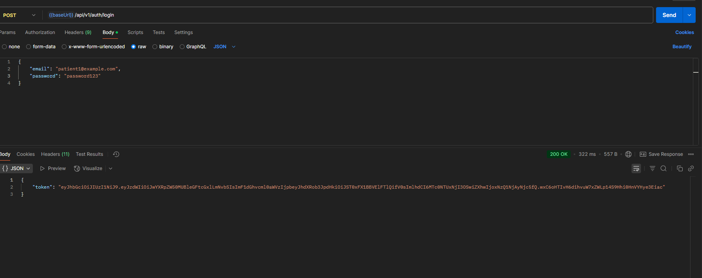
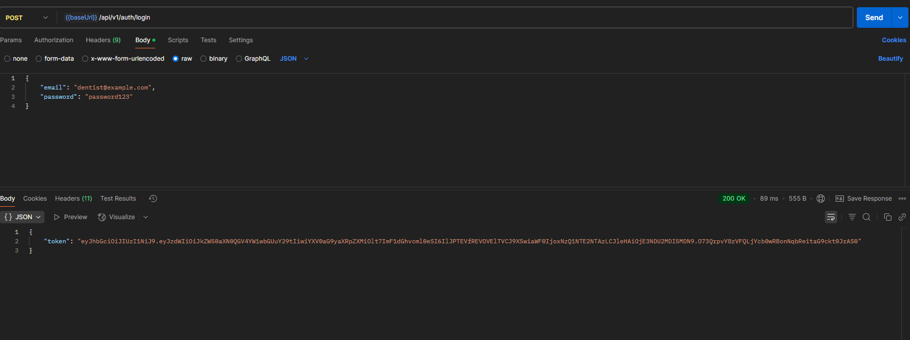
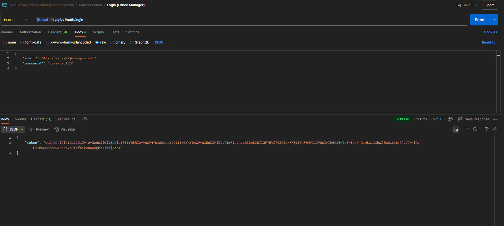
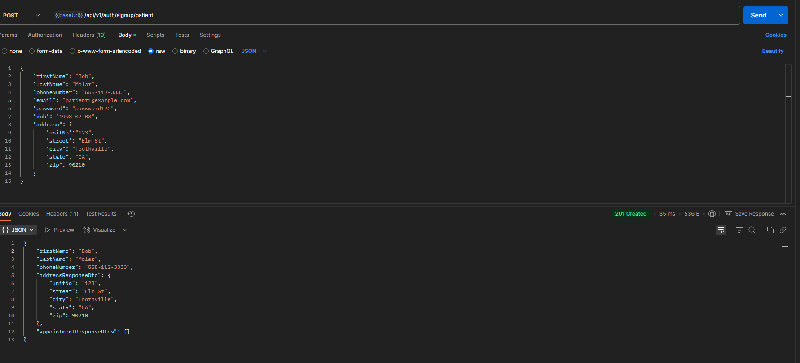
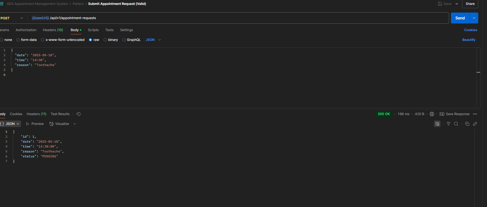
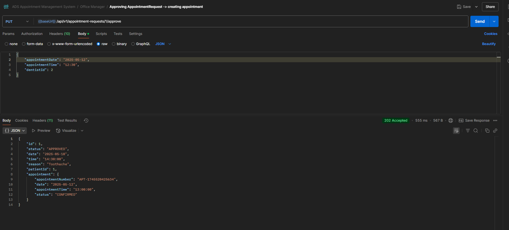
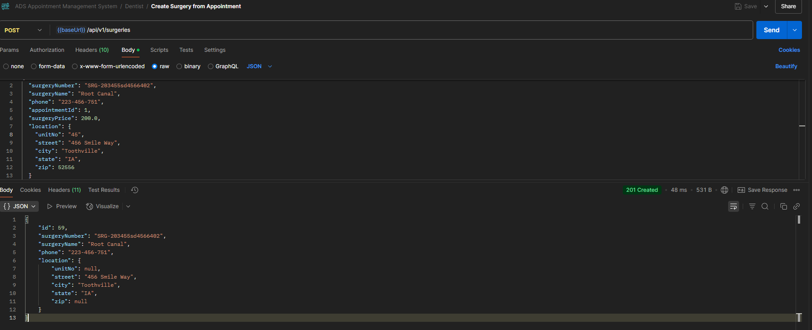
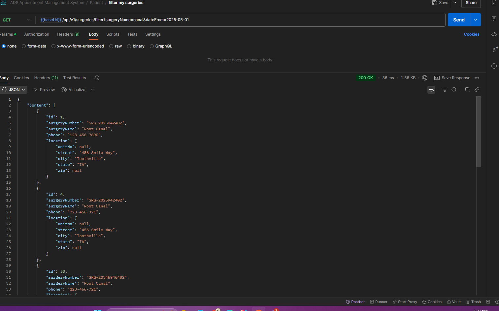
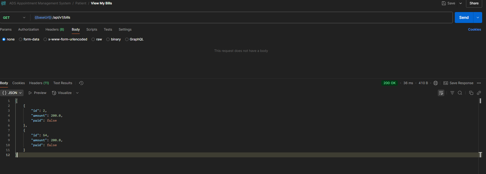
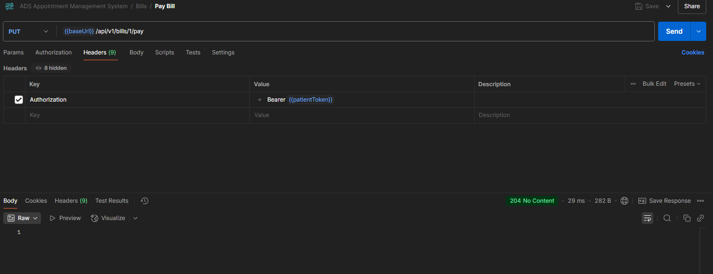

 ## 🦷 ADS Appointment Management System

A full-featured dental clinic appointment management system built with **Spring Boot**, **MySQL**, and **Docker**, supporting role-based access for **Patients**, **Dentists**, and **Office Managers**. The system manages appointments, billing, surgeries, and user registration seamlessly with security, pagination, and RESTful design in mind.

---

## 🚀 Features

- 🔐 **Authentication & Authorization** using JWT and Spring Security
- 📅 **Role-Based Appointments**: Patients request, office managers approve, dentists manage
- 🧾 **Billing Module** with filters for unpaid bills and patient-specific views
- 🏥 **Surgery Management** with dynamic creation and patient linkage
- 📃 **Global Exception Handling** with consistent error format
- 📄 **DTOs + Validation**: Clean API contracts with `@Valid`
- 🔁 **Pagination & Filtering** support across resources
- 📦 **Dockerized** for smooth local and cloud deployment

---

## 🛠️ Technologies Used

| Layer           | Tech Stack                                  |
|----------------|---------------------------------------------|
| Backend         | Java 18, Spring Boot 3, Spring Security     |
| Database        | MySQL                                       |
| API Docs        | Postman, OpenAPI (optional)                 |
| Security        | JWT, Role-based Access with `@PreAuthorize` |
| Mapping         | MapStruct                                   |
| Build Tool      | Gradle Kotlin DSL                           |
| Containerization| Docker, docker-compose                      |
| Testing         | JUnit, Mockito, @DataJpaTest                |

---

## 🗃️ Entity-Relationship Diagram

📌 ## 📄 ER Diagram

You can view the [ER Diagram here](docs/lab2.pdf).

---

## 📸 Screenshots

### 🔐 Login Screens




### 📝 Signup Screens


### 📅 Appointments



### 🏥 Surgeries



### 💵 Bills



---

## 🔐 Security Implementation

- JWT-based authentication
- Role checks via `@PreAuthorize`
- Passwords are hashed using `PasswordEncoder`
- Secure API endpoints by user roles (Patient, Dentist, Office Manager)

---

## ✅ Testing

- Unit tests for:
    - Service Layer (`@Service`)
    - Repository Layer (`@DataJpaTest`)
    - Security and filters
- Mocking with **Mockito**
- Assertions with **AssertJ**

---

## 📦 Dockerized Setup

```bash
# To build and run via docker-compose
docker-compose up --build
